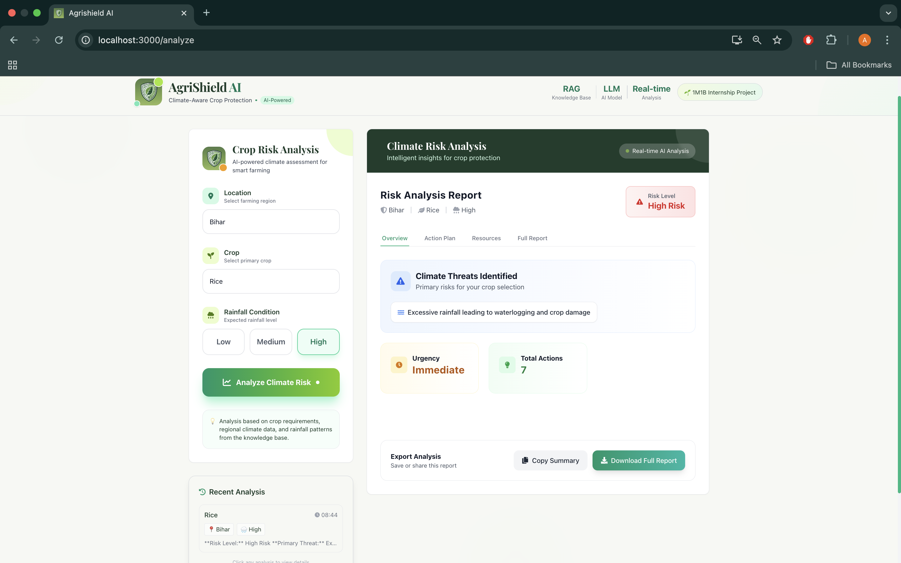

# 🌱 AgriShield AI

**Climate-Aware Crop Risk & Protection Assistant**

AgriShield AI is an AI-powered agricultural decision-support system that analyzes crop vulnerability under changing climate and rainfall conditions. It combines Retrieval-Augmented Generation (RAG) with a locally running LLM (Ollama) and a FastAPI backend to provide explainable, region-aware crop protection recommendations.

Built as part of the **1M1B AI for Sustainability Internship Project**.

---

## 🚀 Key Features

* 🌾 Crop risk assessment based on rainfall & region
* 🧠 RAG-based grounded agricultural responses
* 🔒 Fully offline AI inference using Ollama
* 📍 Region-aware recommendations
* 📑 Structured action plans (Immediate / Short / Long Term)
* 💰 Cost & resource insights
* 🕘 Analysis history tracking
* 🖥️ Clean React + Tailwind UI

---

## 🏗️ Tech Stack

### Frontend

* React + Vite
* Tailwind CSS
* React Icons

### Backend

* FastAPI
* LangChain
* Ollama (Local LLM)
* ChromaDB (Vector Store)

### AI Layer

* Local LLM via Ollama
* Retrieval-Augmented Generation (RAG)
* Domain agricultural knowledge embeddings

---

## 🧠 Architecture Overview

```
User → React Frontend → FastAPI API → LangChain RAG → Chroma Vector DB → Ollama LLM → Structured Response → UI
```

---

## ⚙️ Setup Instructions

### 1️⃣ Clone Repo

```bash
git clone https://github.com/Arni005/Agrishield_AI.git
cd Agrishield_AI
```

---

### 2️⃣ Backend Setup

```bash
cd backend
python3 -m venv venv
source venv/bin/activate
pip install -r requirements.txt
```

Run backend:

```bash
uvicorn api:app --reload
```

Backend runs at:

```
http://127.0.0.1:8000
```

---

### 3️⃣ Frontend Setup

```bash
cd frontend
npm install
npm run dev
```

Frontend runs at:

```
http://localhost:5173
```

---

### 4️⃣ Run Ollama (Required)

Make sure Ollama is installed and running:

```bash
ollama run llama
```

(Use whichever model you configured.)

---

## 📂 Project Structure

```
Agrishield_AI/
│
├── backend/
│   ├── api.py
│   ├── rag_engine/
│   ├── db/ (Chroma Vector DB)
│   └── requirements.txt
│
├── frontend/
│   ├── src/components
│   ├── pages
│   ├── public
│   ├── App.jsx
│   └── package.json
└── README.md
```

---

## 📌 Use Case

Helps farmers:

* Predict crop risks under rainfall variability
* Understand threats (drought, flooding, disease risk)
* Get prioritized protection strategies
* Plan resource allocation efficiently


---
## Workflow


---

## User Interface



---

---
## 👩‍💻 Developed By

**Arni Johry**
1M1B AI for Sustainability Virtual Intern

---

